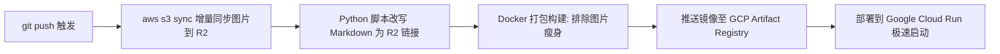

# Cloudflare R2 图床自动化配置指南 (`R2_SETUP.md`)

本文档指导如何在 Cloudflare 控制台与 GitHub 仓库中完成配置，实现**本地 Markdown 图片离线可用 + CI 自动增量同步 R2 + 自动替换为 CDN 链接 + Docker 镜像极速瘦身**。

---

## 目录
1. [Cloudflare R2 控制台配置](#一cloudflare-r2-控制台配置)
   - 1.1 创建 R2 存储桶 (Bucket)
   - 1.2 绑定自定义域名 (Custom Domain)
   - 1.3 生成 S3 兼容 API 令牌 (API Token)
2. [GitHub Secrets 环境变量配置](#二github-secrets-环境变量配置)
3. [Obsidian 本地配置与写作体验](#三obsidian-本地配置与写作体验)
4. [本地测试与验证方法](#四本地测试与验证方法)

---

## 一、Cloudflare R2 控制台配置

### 1.1 创建 R2 存储桶 (Bucket)
1. 登录 [Cloudflare Dashboard](https://dash.cloudflare.com/)。
2. 在左侧导航栏点击 **R2**。
3. 点击 **Create bucket**（创建存储桶）。
4. 填写存储桶名称（例如 `blog-assets`），位置选择建议选 **Automatic** 或靠近你受众的区域（例如亚太 APAC）。
5. 点击 **Create Bucket** 完成创建。

### 1.2 绑定自定义域名与公共访问
R2 存储桶创建后默认私有。为了通过 CDN 快速公开分发图片：
1. 进入刚刚创建的存储桶（如 `blog-assets`），切换到 **Settings**（设置）选项卡。
2. 找到 **Public access**（公开访问）区域下的 **Custom Domains**（自定义域）。
3. 点击 **Connect Domain**（连接网域）。
4. 输入你想要用来做图床分发的子域名（例如 `img.yourdomain.com`，前提是该主域名托管在 Cloudflare 上）。
5. 点击 **Continue** 并按照提示确认 DNS 记录绑定。绑定完成后状态会显示为 **Active**。
6. （可选）在缓存规则（Caching Rule）中可将该自定义域名的静态资源缓存时间设置为 1 年以上，享受 Cloudflare 全球边缘节点的强劲缓存。

> 💡 **CDN 链接格式**：
> 若在 R2 中图片上传到 `attachments/` 前缀下，则图片的公开访问基础 URL 即为：
> `https://img.yourdomain.com/attachments`

### 1.3 生成 S3 兼容 API 凭证 (Token)
Cloudflare R2 完全兼容 AWS S3 API，GitHub Actions 将使用 `aws-cli` 与 S3 协议上传：
1. 返回 Cloudflare **R2 Overview** 页面（点击左侧菜单的 **R2**）。
2. 在页面右侧找到 **Account Details**（账户详情），复制并记录下你的 **Account ID**（即 `R2_ACCOUNT_ID`）。
3. 在右侧面板中点击 **Manage R2 API Tokens**（管理 R2 API 令牌）。
4. 点击 **Create API token**（创建 API 令牌）：
   - **Token name**：例如 `github-actions-blog-sync`。
   - **Permissions**：选择 **Object Read & Write**（对象读写）。
   - **Specify bucket(s)**：推荐选择 **Apply to specific buckets only**，并选中刚才创建的 `blog-assets` 桶。
   - **TTL**：根据安全规范选择（建议永久或设为长周期）。
5. 点击页面最下方的 **Create API Token**。
6. **重要**：在生成的凭证页面中，立即复制并保存以下两个值（离开后无法再次查看 Secret）：
   - **Access Key ID**（对应 `R2_ACCESS_KEY_ID`）
   - **Secret Access Key**（对应 `R2_SECRET_ACCESS_KEY`）

---

## 二、GitHub Secrets 环境变量配置

请进入 GitHub 仓库：**Settings** ➔ **Secrets and variables** ➔ **Actions** ➔ 点击 **New repository secret**，依次添加以下 5 个配置项：

| Secret / Variable 名称 | 示例值 | 说明 |
| :--- | :--- | :--- |
| `R2_ACCOUNT_ID` | `a1b2c3d4e5f6...` | Cloudflare 账户 ID（在 R2 页面右侧复制） |
| `R2_ACCESS_KEY_ID` | `9f8e7d6c5b...` | R2 API Token 的 Access Key ID |
| `R2_SECRET_ACCESS_KEY` | `1a2b3c4d5e6f7...` | R2 API Token 的 Secret Access Key |
| `R2_BUCKET_NAME` | `blog-assets` | 你在 R2 创建的存储桶名称 |
| `R2_CDN_BASE_URL` | `https://img.yourdomain.com/attachments` | 线上 CDN 图片访问前缀（末尾不要多余斜杠） |

> 📌 **安全提示**：
> GitHub Actions 流水线中做了安全兼容判断。在这些 Secrets 配置好之前，流水线会自动跳过同步步骤，不会阻断原有构建。

---

## 三、Obsidian 本地配置与写作体验

你的本地写作流程无需任何改变：
1. 在 Obsidian 中截图后直接 `Ctrl + V` 粘贴。
2. 无论 Obsidian 生成的是：
   - 标准相对路径：`` 或 ``
   - 还是 Wiki-link 嵌入：`![[photo.png]]`、`![[photo.png|800]]`
3. 本地预览、离线写作体验完全不受影响，本地硬盘始终保留完整原图。
4. 执行 `git push` 推送 Markdown 源码与本地图片至 GitHub 即可，后续全交由 CI 自动化处理！

---

## 四、本地测试与验证方法

你可以在本地提前模拟测试链接替换效果（不会修改本地文件）：

### 1. 模拟预览（Dry-Run 模式）
在项目根目录运行：
```bash
python scripts/sync_and_replace_assets.py --cdn-base-url "https://img.yourdomain.com/attachments" --dry-run --verbose
```
控制台将输出所有检测到的图片语法与拟替换的目标 URL。

### 2. 执行单元测试
```bash
python -m unittest tests/test_sync_and_replace.py
```
可验证包括标准 Markdown 相对路径、Obsidian Wiki-link（含别名/尺寸）、外部链接保护、代码块保护等全套测试用例。

---

## 五、CI 自动化运作流程概述

每次向 `main` 分支执行 `git push` 时，GitHub Actions 会按以下时序自动执行：

- **增量同步 (Fast Sync)**：`aws s3 sync` 自动比对文件大小与修改时间，仅上传新增或修改的图片。
- **构建层无脏数据**：链接替换仅在 CI Runner 的临时工作区执行，不会提交回 GitHub 代码库。
- **镜像极致瘦身**：本地图片已被 `.dockerignore` 排除，Cloud Run 镜像体积缩减，冷启动大幅加快。
