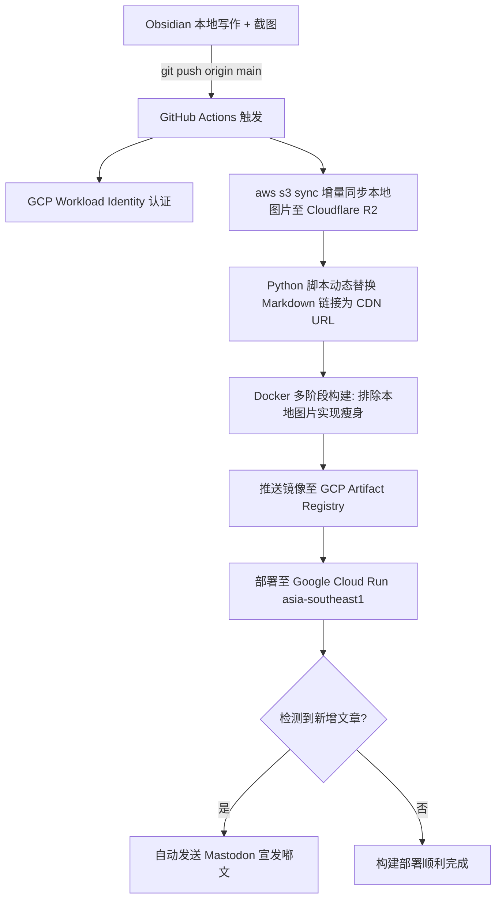

# Dusty's Modern Tech Blog 🚀

> 现代极简、高性能的云原生个人技术博客。基于 **Astro v5 + Google Cloud Run + Cloudflare R2 + GitHub Actions** 构建，融合 **Obsidian 本地离线写作** 与全自动化 CI/CD 发布流水线。

---

## 🌟 核心特性与架构亮点

- **⚡ 极致加载性能**：采用 [Astro v5](https://astro.build/) 静态生成（SSG），零默认客户端 JS 运行时，Lighthouse 性能指标满分。
- **📝 Obsidian 离线写作体验**：
  - 本地截图直接 `Ctrl + V` 粘贴，原图保存在本地，离线写作与本地阅读体验完好。
  - 标准相对路径及 Obsidian Wiki-link（`![[...]`）自动解析与兼容。
- **☁️ Cloudflare R2 自动化图床**：
  - 利用 R2 的 **0 出口流量费** 与自定义 CDN 域名（`blogimg.uptodate.top`）进行全球边缘分发。
  - GitHub Actions 流水线通过 S3 协议进行**增量图片同步（Fast Sync）**。
  - CI 构建前动态将 Markdown 内的本地图片路径重写为线上 CDN 绝对链接，不污染本地 Git 历史。
- **🐳 Docker 镜像极致瘦身**：
  - 本地重资产物理图片在打包时被 `.dockerignore` 排除，仅保留静态 HTML 与轻量 Alpine Nginx。
  - 极小镜像体积，大幅加快构建推送速度与容器冷启动。
- **☁️ Google Cloud Run 部署**：
  - 托管于新加坡数据中心（`asia-southeast1`），超低延迟直连海缆。
  - 基于 GitHub OIDC 与 GCP Workload Identity Federation（无密钥安全认证）。
  - 支持自动缩容至 0 实例，闲时零成本消耗。
- **🤖 LLM 友好与生成式引擎优化 (GEO)**：
  - 原生提供 [`/llms.txt`](https://blog.dustyat.com/llms.txt) 与 [`/llms-full.txt`](https://blog.dustyat.com/llms-full.txt) 供 AI 知识抓取。
  - 文章页提供“引用给 AI”功能，一键复制带规范出处的结构化提示词。
- **🐘 Mastodon 社交生态联动**：
  - 文章页集成 Mastodon 浮窗互动挂件。
  - CI 流水线检测到新增博文时，自动同步宣发嘟文至 Mastodon。
- **🎨 现代化阅读体验**：
  - 自动适配系统的浅色/深色暗黑模式。
  - 顶部滚动阅读进度条与代码块一键复制按钮。
  - 每篇文章自动关联 GitHub 提交历史记录（Commits）徽章，便于追溯修订。

---

## 🔄 自动化 CI/CD 流程架构



---

## 📁 目录结构说明

```text
├── .github/workflows/
│   └── deploy.yml              # GitHub Actions CI/CD 流水线配置
├── public/                     # 网站静态资源（favicon、robots.txt 等）
├── scripts/
│   ├── sync_and_replace_assets.py  # CI 图片链接改写脚本（Python 3 原生库）
│   └── post-to-mastodon.mjs        # Mastodon 自动发嘟脚本
├── src/
│   ├── assets/                 # 静态字体及本地素材
│   │   └── fonts/              # Atkinson 字体文件
│   ├── components/             # Astro 界面组件（Header, Footer, MastodonWidget 等）
│   ├── content/
│   │   └── blog/               # 博文 Markdown 与 MDX 文件
│   │       └── _templates/     # Obsidian 文章模板 (Post Template.md)
│   ├── layouts/                # 页面布局模板（BlogPost.astro 等）
│   ├── pages/                  # 网站路由页面（首页, 博客列表, 关于页面, RSS 等）
│   ├── styles/                 # 全局 CSS 变量与设计体系
│   └── content.config.ts       # Astro Content Collections 集合强类型 Schema 定义
├── tests/                      # Python 自动化测试用例
├── .dockerignore               # Docker 构建排除规则（排除图片附件以瘦身）
├── Dockerfile                  # Node.js 构建 + Nginx 运行时多阶段容器定义
├── nginx.conf.template         # Cloud Run 环境变量端口动态模板
├── R2_SETUP.md                 # Cloudflare R2 图床配置手册
└── astro.config.mjs            # Astro 站点配置
```

---

## 🛠️ 本地开发与指令

### 1. 启动本地开发服务
```bash
npm install
npm run dev
```
> 本地开发模式下，访问 `http://localhost:4321` 即可预览。

### 2. 生产构建打包
```bash
npm run build
```
编译产物将输出至 `./dist/` 目录。

### 3. 本地测试图片链接改写（预览模式）
```bash
# 执行 Dry-Run，不修改本地文件
python scripts/sync_and_replace_assets.py --cdn-base-url "https://blogimg.uptodate.top/attachments" --dry-run -v

# 运行自动化单元测试
python -m unittest tests/test_sync_and_replace.py
```

---

## ✍️ 日常写作发布流程

1. **新建文章**：在 Obsidian 中使用模板 `Post Template.md` 创建新笔记，`title` 与 `description` 会自动生成。
2. **插入配图**：直接剪贴板粘贴截图即可，无需关心图床上传。
3. **推送到 GitHub**：
   ```bash
   git add .
   git commit -m "feat: 发布新文章"
   git push
   ```
4. 后续的所有步骤（增量推送到 R2、改写 CDN 链接、打包精简容器、部署到 Cloud Run、发嘟文）均由 GitHub Actions 自动化完成！

---

## 📄 许可说明

本项目代码采用 [MIT License](LICENSE) 开源，博客所有原创文章与内容保留作者所有权。
