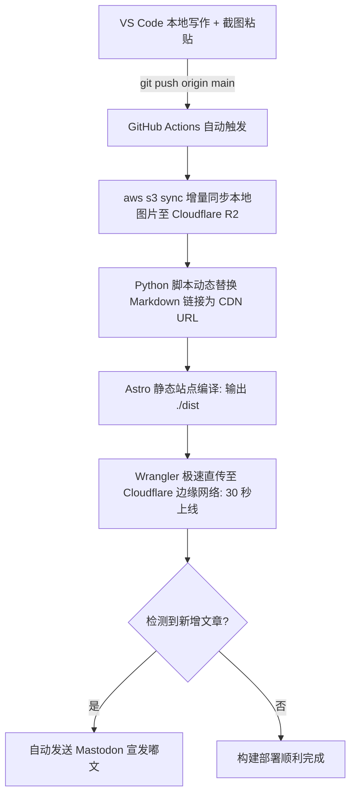

# dusty's blog 🚀

> 现代极简、高性能的云原生个人技术博客。基于 **Astro v5 + Cloudflare (Workers & Assets + R2) + GitHub Actions** 构建，融合 **VS Code 原生极简写作流** 与 30 秒全自动化 CI/CD 交付体系。

---

## 🌟 核心特性与架构亮点

- **⚡ 极致加载性能与全球边缘直出**：
  - 采用 [Astro v5](https://astro.build/) 静态生成（SSG），零客户端 JS 运行时负担；
  - 托管于 **Cloudflare 300+ 全球边缘 Anycast 节点**，首屏秒开，彻底告别容器冷启动延迟。
- **🧭 极简单流架构（Hacker Stream）**：
  - 导航栏采用经典极客风格：左侧「Icon + blog」极简品牌标识，右侧「文章」、「关于」、双视图切换、Spotlight 搜索与主题调色盘；
  - 整体视觉去除了冗余的时间轴竖线，以留白与呼吸感排版呈现博文，界面更纯粹利落。
- **👁️ 极客双视图自由切换（Feed & Compact）**：
  - 导航栏集成专属一键切换按钮（同一个按钮随视图模式动态平滑切换）：
    - **图文模式（Feed View，默认）**：卡片式呈现，配备首图封面微缩图、智能纯文本摘要与标签，视觉饱满有质感；
    - **紧凑列表模式（Compact Mode）**：隐去大封面与长摘要，单行紧凑呈现 `发布日期 ｜ 文章标题 ｜ 标签`，信息密度大幅提升，单屏高效扫读数十篇；
  - 本地 `localStorage` 自动持久记忆访客偏好，`<head>` 内置零闪烁秒开脚本。
- **📅 智能按年份折叠时间流（Collapsible Year Timeline）**：
  - 当年（最新年份）默认展开，往年历史自动折叠，避免文章增多时页面无限拉长；
  - 年份标题栏配备文章篇数胶囊徽章（如 `12 篇`）与平滑旋转指示箭头，点击整行可按需自由展开/收起；
  - **标签筛选智能联动**：点击标签过滤时，包含命中文章的年份自动展开，重置筛选自动恢复默认折叠状态。
- **🔍 Spotlight 瞬时全局搜索**：
  - 支持快捷键 `Ctrl+K` / `⌘K` 或 `/` 呼出搜索弹窗；
  - 毫秒级模糊检索文章标题、正文摘要及标签，关键词高亮匹配，支持键盘方向键与回车一键直达。
- **🏷️ 标签动态交互与即时筛选**：
  - 文章标签点击即过滤同类博文，智能联动展开与收起年份分组，URL 参数无刷新同步，支持一键重置。
- **🎨 4 档主题色随心切换与持久记忆**：
  - 支持 **静电白 (#FFFFFF)**、**暖白 (#FCFAF8)**、**护眼米黄 (#F5F5D5)** 与 **暗黑模式 (#0D1117)**，黑白双态圆点合并，点击切换并自动记忆访客偏好。
- **✍️ 零心智负担的 VS Code 原生写作流**：
  - **自动派生标题**：新建文件（如 `how-to-use-astro.md`）后输入 `post` 展开模板，文件名中的 `-` 自动转换为空格并高亮预填为标题，回车即开写；
  - **首图自动提升封面（去重呈现）**：正文直接 `Ctrl + V` 贴图，系统构建时自动将正文第一张配图识别为时间线卡片封面及 OpenGraph 社交卡片，正文内自然呈现，绝无重复大图横幅；
  - **智能纯文本摘要**：`description` 默认留空，构建时自动剥离 Markdown 语法、代码块与图片，精准提取前 140 字纯文本摘要；
  - **内容智能标签识别**：未显式指定 `tags` 时，构建系统基于 17+ 种规则库（Astro、VS Code、Python、Cloudflare、Docker、AI/LLM、工作流等）自动匹配正文关键词打标；
  - **文件按文章独立归档**：原生粘贴自动保存至 `attachments/<article-name>/<image-name>`，完全脱离第三方笔记插件依赖。
- **☁️ Cloudflare R2 自动化图床**：
  - 利用 R2 的 **0 出口流量费** 与自定义 CDN 域名进行全球边缘分发；
  - GitHub Actions 流水线通过 S3 协议进行**增量图片同步（Fast Sync）**；
  - CI 构建前动态将 Markdown 内的本地图片路径重写为线上 CDN 绝对链接，保持本地离线文件整洁无污染。
- **🤖 LLM 友好与生成式引擎优化 (GEO)**：
  - 原生提供 [`/llms.txt`](https://blog.dustyat.com/llms.txt) 与 [`/llms-full.txt`](https://blog.dustyat.com/llms-full.txt) 供大模型抓取与知识索引；
  - 文章页提供“引用给 AI”功能，一键复制带规范出处的结构化提示词。
- **🐘 Mastodon 社交生态联动**：
  - 文章页集成 Mastodon 浮窗互动挂件；
  - CI 流水线检测到新增博文时，自动同步宣发嘟文至 Mastodon。

---

## 🔄 自动化 CI/CD 流程架构


```mermaid
flowchart TD
    A[VS Code 本地写作 + 截图粘贴] -->|git push origin main| B[GitHub Actions 自动触发]
    B --> C[aws s3 sync 增量同步本地图片至 Cloudflare R2]
    C --> D[Python 脚本动态替换 Markdown 链接为 CDN URL]
    D --> E[Astro 静态站点编译: 输出 ./dist]
    E --> F[Wrangler 极速直传至 Cloudflare 边缘网络: 30 秒上线]
    F --> G{检测到新增文章?}
    G -->|是| H[自动发送 Mastodon 宣发嘟文]
    G -->|否| I[构建部署顺利完成]
```

---

## 📁 目录结构说明

```text
├── .github/workflows/
│   └── deploy.yml              # GitHub Actions CI/CD 流水线（R2 同步 + Astro 构建 + Cloudflare 部署）
├── public/                     # 网站静态资源（favicon、robots.txt 等）
├── scripts/
│   ├── sync_and_replace_assets.py  # CI 图片链接改写脚本（Python 3 原生库）
│   └── post-to-mastodon.mjs        # Mastodon 自动发嘟脚本
├── src/
│   ├── assets/                 # 静态字体及本地素材
│   ├── components/             # Astro 界面组件（Header, SearchModal, ThemeToggle 等）
│   ├── content/
│   │   └── blog/               # 博文 Markdown 与 MDX 文件
│   │       ├── attachments/    # 本地图片附件（按文章子目录归档）
│   │       └── .vscode/        # 工作区配置与文章 Frontmatter 代码片段
│   ├── layouts/                # 页面布局模板（BlogPost.astro）
│   ├── pages/                  # 网站路由页面（首页时间流, 关于页面, 搜索索引, RSS 等）
│   ├── styles/                 # 全局 CSS 变量与设计体系（含多套主题配色与发丝时间线）
│   ├── utils/                  # 核心工具函数（post.ts: 自动摘要、智能标签、首图解析）
│   └── content.config.ts       # Astro Content Collections 集合强类型 Schema 定义
├── tests/                      # Python 自动化测试用例
├── wrangler.jsonc              # Cloudflare Workers / Static Assets 配置文件
├── R2_SETUP.md                 # Cloudflare R2 图床配置手册
├── astro.config.mjs            # Astro 站点配置
└── package.json                # 项目依赖与开发指令
```

---

## 🛠️ 本地开发与指令

### 1. 启动本地开发服务
```bash
npm install
npm run dev
```
> 本地开发模式下，访问 `http://localhost:4321` 即可预览。

### 2. 生产构建打包
```bash
npm run build
```
编译产物将输出至 `./dist/` 目录。

### 3. 本地测试图片链接改写（预览模式）
```bash
# 执行 Dry-Run，不修改本地文件
python scripts/sync_and_replace_assets.py --cdn-base-url "https://blogimg.uptodate.top/attachments" --dry-run -v

# 运行自动化单元测试
python -m unittest tests/test_sync_and_replace.py
```

---

## ✍️ 日常极简写作发布流程

1. **新建文章**：在 `src/content/blog/` 下新建 `.md` 文件（如 `my-new-post.md`）；
2. **展开模板**：在文件内输入 `post` 回车，模板自动将文件名转为空格标题，`description` 留空，`heroImage` 和 `tags` 默认注释；
3. **沉浸式码字**：直接在正文中写字，需要配图时直接 `Ctrl + V` 粘贴（首张配图将自动成为博客时间线封面）；
4. **提交推送**：
   ```bash
   git add .
   git commit -m "feat: 发布新文章"
   git push
   ```
5. **30 秒全自动交付**：增量同步新图到 R2 ➔ 改写线上 CDN 链接 ➔ 编译静态网站 ➔ 直传 Cloudflare 300+ 边缘节点 ➔ 自动发推宣发，全流程无需人工干预！

---

## 📄 许可说明

本项目代码采用 [MIT License](LICENSE) 开源，博客所有原创文章与内容保留作者所有权。
