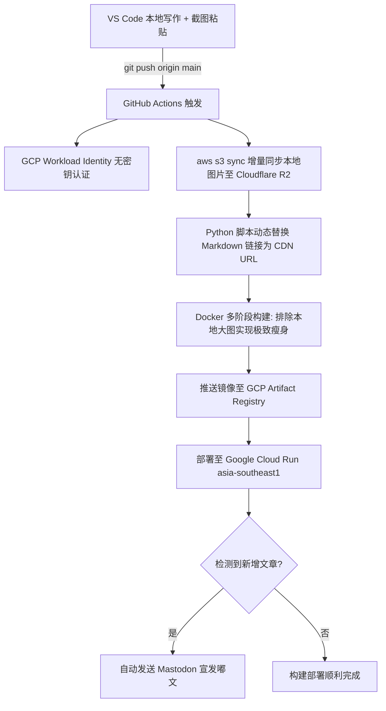

# dusty's blog 🚀

> 现代极简、高性能的云原生个人技术博客。基于 **Astro v5 + Google Cloud Run + Cloudflare R2 + GitHub Actions** 构建，融合 **VS Code 原生极简写作流** 与全自动化 CI/CD 交付体系。

---

## 🌟 核心特性与架构亮点

- **⚡ 极致加载性能**：采用 [Astro v5](https://astro.build/) 静态生成（SSG），零客户端 JS 运行时负担，Lighthouse 性能指标近满分。
- **🧭 极简单流架构（Hacker Stream）**：
  - 导航栏采用经典极客风格：左侧「dusty's blog」品牌标识，右侧「文章」与「关于」；
  - 首页即全量博文时间流，卡片配备双栏响应式设计（文章标题、自动摘要、智能标签与封面微缩图），视觉层次清晰；
  - 路由自动规范化，历史 `/blog/` 路径自动 301 重定向至首页。
- **✍️ 零心智负担的 VS Code 原生写作流**：
  - **自动派生标题**：新建文件（如 `how-to-use-astro.md`）后输入 `post` 展开模板，文件名中的 `-` 自动转换为空格并高亮预填为标题，回车即开写；
  - **首图自动提升封面（去重呈现）**：正文直接 `Ctrl + V` 贴图，系统构建时自动将正文第一张配图识别为时间线卡片封面及 OpenGraph 社交卡片，正文内自然呈现，绝无重复大图横幅；
  - **智能纯文本摘要**：`description` 默认留空，构建时自动剥离 Markdown 语法、代码块与图片，精准提取前 140 字纯文本摘要；
  - **内容智能标签识别**：未显式指定 `tags` 时，构建系统基于 17+ 种规则库（Astro、VS Code、Python、Cloudflare、Docker、AI/LLM、工作流等）自动匹配正文关键词打标；
  - **文件按文章独立归档**：原生粘贴自动保存至 `attachments/<article-name>/<image-name>`，完全脱离第三方笔记插件依赖。
- **☁️ Cloudflare R2 自动化图床**：
  - 利用 R2 的 **0 出口流量费** 与自定义 CDN 域名进行全球边缘分发；
  - GitHub Actions 流水线通过 S3 协议进行**增量图片同步（Fast Sync）**；
  - CI 构建前动态将 Markdown 内的本地图片路径重写为线上 CDN 绝对链接，保持本地离线文件整洁无污染。
- **🐳 Docker 镜像极致瘦身**：
  - 本地物理图片文件在打包镜像时被 `.dockerignore` 排除，仅保留静态 HTML/CSS 与轻量 Alpine Nginx；
  - 极小镜像体积，大幅加快构建推送速度与容器冷启动。
- **☁️ Google Cloud Run 部署**：
  - 托管于新加坡数据中心（`asia-southeast1`），超低延迟直连海缆；
  - 基于 GitHub OIDC 与 GCP Workload Identity Federation（无密钥安全认证）；
  - 支持自动缩容至 0 实例，闲时零成本消耗。
- **🤖 LLM 友好与生成式引擎优化 (GEO)**：
  - 原生提供 [`/llms.txt`](https://blog.dustyat.com/llms.txt) 与 [`/llms-full.txt`](https://blog.dustyat.com/llms-full.txt) 供大模型抓取与知识索引；
  - 文章页提供“引用给 AI”功能，一键复制带规范出处的结构化提示词。
- **🐘 Mastodon 社交生态联动**：
  - 文章页集成 Mastodon 浮窗互动挂件；
  - CI 流水线检测到新增博文时，自动同步宣发嘟文至 Mastodon。
- **🎨 现代阅读体验**：
  - 自动适配系统的浅色 / 深色暗黑模式；
  - 顶部滚动阅读进度条与代码块一键复制按钮；
  - 每篇文章自动关联 GitHub 提交历史记录（Commits）徽章，便于追溯版本变化。

---

## 🔄 自动化 CI/CD 流程架构


```mermaid
flowchart TD
    A[VS Code 本地写作 + 截图粘贴] -->|git push origin main| B[GitHub Actions 触发]
    B --> C[GCP Workload Identity 无密钥认证]
    B --> D[aws s3 sync 增量同步本地图片至 Cloudflare R2]
    D --> E[Python 脚本动态替换 Markdown 链接为 CDN URL]
    E --> F[Docker 多阶段构建: 排除本地大图实现极致瘦身]
    F --> G[推送镜像至 GCP Artifact Registry]
    G --> H[部署至 Google Cloud Run asia-southeast1]
    H --> I{检测到新增文章?}
    I -->|是| J[自动发送 Mastodon 宣发嘟文]
    I -->|否| K[构建部署顺利完成]
```

---

## 📁 目录结构说明

```text
├── .github/workflows/
│   └── deploy.yml              # GitHub Actions CI/CD 流水线配置
├── public/                     # 网站静态资源（favicon、robots.txt 等）
├── scripts/
│   ├── sync_and_replace_assets.py  # CI 图片链接改写脚本（Python 3 原生库）
│   └── post-to-mastodon.mjs        # Mastodon 自动发嘟脚本
├── src/
│   ├── assets/                 # 静态字体及本地素材
│   ├── components/             # Astro 界面组件（Header, BaseHead, MastodonWidget 等）
│   ├── content/
│   │   └── blog/               # 博文 Markdown 与 MDX 文件
│   │       ├── attachments/    # 本地图片附件（按文章子目录归档）
│   │       └── .vscode/        # 工作区配置与文章 Frontmatter 代码片段
│   ├── layouts/                # 页面布局模板（BlogPost.astro）
│   ├── pages/                  # 网站路由页面（首页时间流, 关于页面, RSS, llms.txt 等）
│   ├── styles/                 # 全局 CSS 变量与设计体系
│   ├── utils/                  # 核心工具函数（post.ts: 自动摘要、智能标签、首图解析）
│   └── content.config.ts       # Astro Content Collections 集合强类型 Schema 定义
├── tests/                      # Python 自动化测试用例
├── .dockerignore               # Docker 构建排除规则（排除图片附件以瘦身）
├── Dockerfile                  # Node.js 构建 + Nginx 运行时多阶段容器定义
├── nginx.conf.template         # Cloud Run 环境变量端口动态模板
├── R2_SETUP.md                 # Cloudflare R2 图床配置手册
└── astro.config.mjs            # Astro 站点配置
```

---

## 🛠️ 本地开发与指令

### 1. 启动本地开发服务
```bash
npm install
npm run dev
```
> 本地开发模式下，访问 `http://localhost:4321` 即可预览。

### 2. 生产构建打包
```bash
npm run build
```
编译产物将输出至 `./dist/` 目录。

### 3. 本地测试图片链接改写（预览模式）
```bash
# 执行 Dry-Run，不修改本地文件
python scripts/sync_and_replace_assets.py --cdn-base-url "https://blogimg.uptodate.top/attachments" --dry-run -v

# 运行自动化单元测试
python -m unittest tests/test_sync_and_replace.py
```

---

## ✍️ 日常极简写作发布流程

1. **新建文章**：在 `src/content/blog/` 下新建 `.md` 文件（如 `my-new-post.md`）；
2. **展开模板**：在文件内输入 `post` 回车，模板自动将文件名转为空格标题，`description` 留空，`heroImage` 和 `tags` 默认注释；
3. **沉浸式码字**：直接在正文中写字，需要配图时直接 `Ctrl + V` 粘贴（首张配图将自动成为博客时间线封面）；
4. **提交推送**：
   ```bash
   git add .
   git commit -m "feat: 发布新文章"
   git push
   ```
5. 后续的所有步骤（增量推送到 R2、改写 CDN 链接、打包精简容器、部署到 Cloud Run、自动发嘟）均由 GitHub Actions 自动化完成！

---

## 📄 许可说明

本项目代码采用 [MIT License](LICENSE) 开源，博客所有原创文章与内容保留作者所有权。
